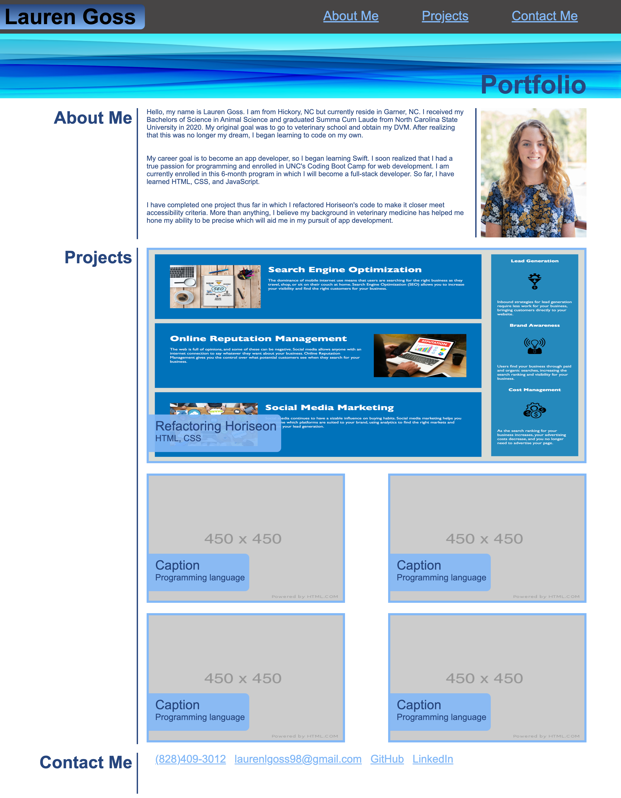

# lauren-goss-portfolio

I created a portfolio to share some information about myself, showcase my deployed applications, and share my contact information.

## Features

* Navigation links in header.

* 5 most recent projects, with the newest project in the largest top spot.

* Links within each project screenshot that take the user to the deployed application.

* Links to my contact information in footer.

## Link to Application

https://laurenlgoss.github.io/lauren-goss-portfolio/

## Screenshot of Application

